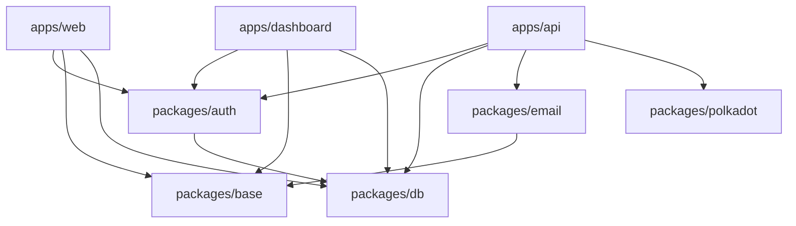

import { Callout } from 'fumadocs-ui/components/callout';
import { Tabs, Tab } from 'fumadocs-ui/components/tabs';

# Project Structure

Opentribe is built as a **Turborepo monorepo** with clear separation between applications and shared packages. This architecture enables efficient development, code reuse, and independent deployment.

## Repository Overview

```
opentribe/
├── 📁 apps/                    # Applications
│   ├── 📁 api/                 # REST API server
│   ├── 📁 dashboard/           # Authenticated user dashboard
│   ├── 📁 web/                 # Public website
│   └── 📁 docs/                # Documentation site
│
├── 📁 packages/                # Shared packages
│   ├── 📁 auth/                # Better Auth configuration
│   ├── 📁 base/                # UI components (shadcn/ui)
│   ├── 📁 db/                  # Prisma schema & database client
│   ├── 📁 email/               # Email templates
│   ├── 📁 polkadot/            # Blockchain utilities
│   └── 📁 types/               # Shared TypeScript types
│
├── 📄 turbo.json               # Turborepo configuration
├── 📄 package.json             # Root package configuration
├── 📄 pnpm-workspace.yaml      # pnpm workspace configuration
└── 📄 README.md                # Project documentation
```

## Applications

### `apps/web` - Public Website

The marketing and landing site for Opentribe.

**Key Features:**
- Public-facing landing pages
- Opportunity browsing (bounties, grants, RFPs)
- User registration and sign-in
- Builder profiles
- Organization profiles

**Tech Stack:**
- Next.js 15 with App Router
- Server Components
- Tailwind CSS v4
- Glass UI design system

**URL:** https://opentribe.io (production) | http://localhost:3000 (dev)

### `apps/dashboard` - User Dashboard

Authenticated dashboard for builders and organizations.

**Key Features:**
- Builder dashboard (submissions, applications, payments)
- Organization management
- Opportunity creation (bounties, grants, RFPs)
- Submission review and winner selection
- Payment tracking and verification

**Tech Stack:**
- Next.js 15 with App Router
- React Query for data fetching
- Real-time updates
- Role-based access control

**URL:** https://admin.opentribe.io (production) | http://localhost:3001 (dev)

### `apps/api` - REST API Server

Centralized API handling all business logic.

**Key Features:**
- RESTful endpoints for all resources
- Better Auth integration
- Payment verification via Subscan
- Email notifications
- Rate limiting
- CORS configuration

**Endpoints:**
- `/api/v1/bounties`
- `/api/v1/grants`
- `/api/v1/rfps`
- `/api/v1/submissions`
- `/api/v1/organizations`
- `/api/v1/payments/verify`

**URL:** https://api.opentribe.io (production) | http://localhost:3002 (dev)

### `apps/docs` - Documentation

Developer and user documentation.

**Key Features:**
- Getting started guides
- API documentation
- Feature explanations
- Integration guides

**Tech Stack:**
- Fumadocs UI
- MDX for content
- Syntax highlighting
- Dark theme

**URL:** https://docs.opentribe.io (production) | http://localhost:3004 (dev)

## Packages

### `packages/auth` - Authentication

Better Auth configuration and utilities.

```typescript
// packages/auth/server.ts
export const auth = betterAuth({
  database: db,
  providers: [
    email(),
    google(),
    github()
  ],
  plugins: [
    organization(),
    twoFactor()
  ]
})
```

**Features:**
- Session management
- Multiple auth providers
- Organization context
- Role-based permissions

### `packages/db` - Database

Prisma schema and database client.

```prisma
// packages/db/prisma/schema.prisma
model Bounty {
  id             String @id @default(cuid())
  title          String
  description    String
  reward         Decimal
  token          String
  organizationId String
  // ...
}
```

**Key Models:**
- User, Organization, OrganizationMember
- Bounty, Grant, RFP
- Submission, Application
- Payment, Comment, Like, Vote

### `packages/base` - UI Components

Shared component library based on shadcn/ui.

```typescript
// Usage
import { Button } from "@packages/base/components/ui/button"
import { Card } from "@packages/base/components/ui/card"
import { MarkdownEditor } from "@packages/base/components/markdown-editor"
```

**Components:**
- shadcn/ui primitives
- Glass UI design system
- Custom components (MarkdownEditor, Background, Logo)
- Tailwind utilities

### `packages/email` - Email Templates

React Email templates for notifications.

```typescript
// packages/email/templates/welcome.tsx
export const WelcomeEmail = ({ name }: { name: string }) => (
  <Html>
    <Head />
    <Body>
      <Text>Welcome to Opentribe, {name}!</Text>
    </Body>
  </Html>
)
```

**Templates:**
- Welcome emails
- Submission notifications
- Winner selection
- Payment confirmations

### `packages/polkadot` - Blockchain Utilities

Polkadot/Substrate integration utilities.

```typescript
// packages/polkadot/src/payment.ts
export class PaymentService {
  static async verifyPayment(hash: string) {
    // Verify transaction on Subscan
  }

  static async createPaymentRecord(data: PaymentData) {
    // Record payment in database
  }
}
```

**Features:**
- Payment verification via Subscan API
- Address validation
- Transaction utilities
- Network helpers

### `packages/types` - Shared Types

TypeScript type definitions shared across apps.

```typescript
// packages/types/index.ts
export interface Bounty {
  id: string
  title: string
  reward: number
  // ...
}
```

## Configuration Files

### Root Configuration

<Tabs>
<Tab value="turbo" label="turbo.json">

```json
{
  "pipeline": {
    "build": {
      "dependsOn": ["^build"],
      "outputs": [".next/**", "dist/**"]
    },
    "dev": {
      "persistent": true,
      "cache": false
    }
  }
}
```

</Tab>

<Tab value="workspace" label="pnpm-workspace.yaml">

```yaml
packages:
  - "apps/*"
  - "packages/*"
```

</Tab>

<Tab value="package" label="package.json">

```json
{
  "name": "opentribe",
  "private": true,
  "scripts": {
    "dev": "turbo dev",
    "build": "turbo build",
    "test": "turbo test"
  }
}
```

</Tab>
</Tabs>

## Development Workflow

### Package Dependencies



### Build Order

1. **packages/** - Built first (no dependencies)
2. **apps/api** - Depends on packages
3. **apps/web** & **apps/dashboard** - Depend on API
4. **apps/docs** - Independent

### Import Conventions

```typescript
// Import from packages
import { Button } from "@packages/base/components/ui/button"
import { db } from "@packages/db"
import { auth } from "@packages/auth/server"

// Import from app
import { api } from "@/lib/api"
import { cn } from "@/lib/utils"
```

## Environment Structure

Each app has its own `.env.local`:

```
apps/
├── web/
│   └── .env.local
├── dashboard/
│   └── .env.local
├── api/
│   └── .env.local
└── docs/
    └── .env.local
```

<Callout type="warning">
  Never commit `.env.local` files. Use `.env.example` for templates.
</Callout>

## Common Patterns

### API Calls

```typescript
// From web/dashboard to API
const response = await fetch(`${process.env.NEXT_PUBLIC_API_URL}/api/v1/bounties`)
const data = await response.json()
```

### Database Access

```typescript
// Only in apps/api
import { db } from "@packages/db"

const bounties = await db.bounty.findMany({
  where: { status: "active" }
})
```

### Component Usage

```typescript
// In any Next.js app
import { Card } from "@packages/base/components/ui/card"

export function BountyCard() {
  return <Card>...</Card>
}
```

## Deployment

Each app can be deployed independently:

- **web** → Vercel (main domain)
- **dashboard** → Vercel (subdomain)
- **api** → Vercel (API subdomain)
- **docs** → Vercel (docs subdomain)

## Best Practices

1. **Keep packages pure** - No app-specific logic
2. **Use workspace protocol** - `workspace:*` for local packages
3. **Centralize types** - Share via `@packages/types`
4. **API-first** - All data operations through API
5. **Component reuse** - Share UI via `@packages/base`

## Next Steps

- [Configure environment variables](/docs/getting-started/environment-variables)
- [Set up authentication](/docs/setup/authentication)
- [Deploy to production](/docs/deployment)
