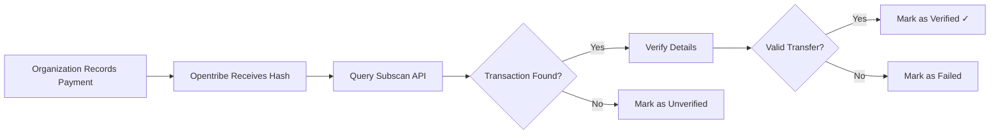

# Payment Verification

Opentribe provides transparent verification of payments made directly between organizations and builders.

## How Verification Works

### 1. Organization Records Payment

After sending a payment through their wallet, organizations provide:
- **Transaction Hash**: The unique identifier from the blockchain
- **Amount**: How much was sent
- **Token**: Which token was used (DOT, USDC, etc.)
- **Recipient Address**: The builder's wallet address

### 2. Automatic On-Chain Verification

When a payment is recorded, Opentribe automatically:



### 3. Verification Checks

Our verification process confirms:

- ✅ **Transaction Exists**: The hash corresponds to a real transaction
- ✅ **Transaction Success**: The transaction was successful on-chain
- ✅ **Transfer Type**: It was a balance transfer (not another operation)
- ✅ **Block Confirmation**: The transaction is in a finalized block

## Verification Status

Payments can have the following statuses:

| Status | Description | What It Means |
|--------|-------------|---------------|
| **Pending** | Payment recorded, verification in progress | Waiting for blockchain confirmation |
| **Verified** ✓ | Transaction confirmed on-chain | Payment successfully completed |
| **Failed** ❌ | Transaction failed on-chain | Payment was attempted but failed |
| **Unverified** ⚠️ | Cannot verify transaction | Hash not found or invalid |

## Viewing Verification Details

### For Builders

1. Go to your profile on opentribe.io
2. Navigate to "Payments" section
3. Each payment shows:
   - Status badge (Verified ✓, Pending, etc.)
   - Transaction hash (clickable link to Subscan)
   - Amount and token
   - Date recorded

### For Organizations

1. Access your organization dashboard
2. Go to "Payment History"
3. View all payments with:
   - Verification status
   - Recipient details
   - Transaction links
   - Timestamps

## Independent Verification

You don't need to trust Opentribe's verification. You can always verify independently:

### Using Subscan

1. Click on any transaction hash in Opentribe
2. You'll be redirected to Subscan.io
3. Verify:
   - Sender address matches organization
   - Receiver address matches your wallet
   - Amount and token are correct
   - Transaction status is "Success"

### Using Polkadot.js

1. Go to [Polkadot.js Apps](https://polkadot.js.org/apps/)
2. Navigate to Network > Explorer
3. Search for the transaction hash
4. Verify all details independently

## Understanding Transaction Hashes

A transaction hash (extrinsic hash) looks like:
```
0x1234567890abcdef1234567890abcdef1234567890abcdef1234567890abcdef
```

This is a unique identifier that:
- Cannot be faked or duplicated
- Points to exactly one transaction
- Is permanently recorded on the blockchain
- Can be verified by anyone, anywhere

## Common Verification Issues

### "Unverified" Status

Possible reasons:
- Transaction is still being processed (wait a few minutes)
- Incorrect hash was provided
- Transaction was on a different network
- Network connectivity issues with Subscan

**Solution**: Wait 5-10 minutes and refresh. If still unverified, check the hash on Subscan directly.

### "Failed" Status

This means the blockchain transaction itself failed:
- Insufficient balance
- Network issues
- Incorrect address format

**Solution**: Organization needs to retry the payment with correct parameters.

## API Verification Endpoint

Developers can verify payments programmatically:

```typescript
POST /api/v1/payments/verify
{
  "extrinsicHash": "0x...",
  "network": "polkadot"
}

// Response
{
  "verified": true,
  "blockNumber": 12345678,
  "success": true,
  "from": "1abc...",
  "to": "1xyz...",
  "amount": "100",
  "token": "DOT"
}
```

## Trust Through Transparency

Opentribe's verification system provides:

- **Immutable Proof**: Blockchain records cannot be altered
- **Public Verification**: Anyone can verify any transaction
- **Real-Time Status**: Instant verification via Subscan API
- **Full Transparency**: All payment details are visible to relevant parties

Remember: Opentribe never touches the funds - we only verify that transactions happened on-chain.

## Need Help?

- Check our [Payment FAQ](/docs/help/faq#payments)
- Contact support for payment verification issues
- Report suspicious payment records to our team
